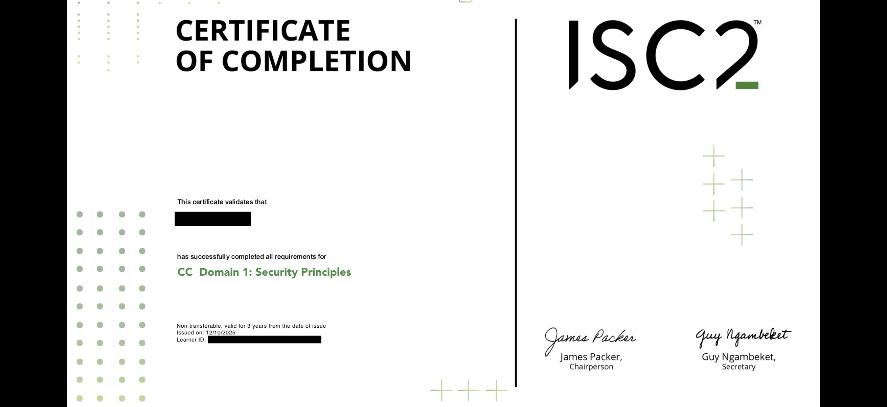

# CC Domain 1: Security Principles  
**Completed:** 12 October 2025  
**Status:** ✅

## Summary  
Domain 1 introduced the core principles that underpin all of cybersecurity. It covered the triad of confidentiality, integrity, and availability (CIA), and how those map to risk, threat, and control models in the real world.

## Key Takeaways  
- CIA triad is foundational: protect data’s privacy, accuracy, and uptime  
- Threats exploit vulnerabilities via attack vectors (e.g. phishing, malware)  
- Security controls (technical, administrative, physical) mitigate risk  
- Principles of least privilege and defense in depth are recurring anchors  
- Non-repudiation = undeniable proof something happened (like a signed delivery receipt)

## Why this matters  
Understanding these first principles is critical before touching tools. Without a clear model of threats, risk, and control, detection and response become guesswork. This domain sets the mental framework that SOC work depends on.

## Certificate of Completion

